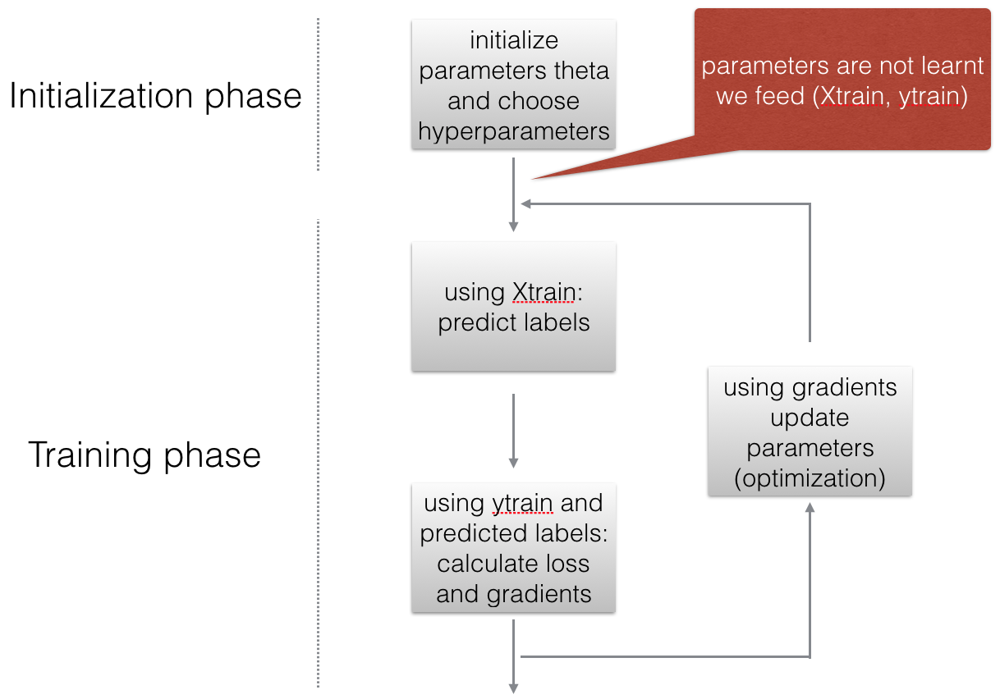
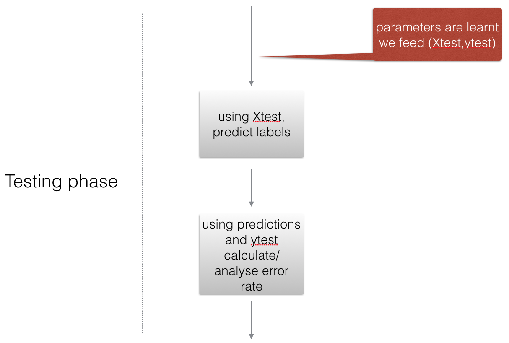

# 🐱 Cat Recognition using Logistic Regression

A complete implementation of **Logistic Regression from scratch** using **Python** and **NumPy** for binary image classification (Cat vs. Non-Cat).

This project was completed while studying the **Deep Learning Specialization** by **Prof. Andrew Ng** and demonstrates the core concepts behind the first neural network model without relying on machine learning libraries such as Scikit-learn.

---

# Project Overview

The objective of this project is to build a binary image classifier capable of determining whether an image contains a **cat** or **not a cat**.

The implementation includes every major component of logistic regression:

- Data preprocessing
- Parameter initialization
- Forward propagation
- Binary Cross-Entropy Cost Function
- Backward propagation
- Gradient Descent optimization
- Prediction
- Model evaluation

---

# Model Workflow

## 1. Training Phase

During training, the model starts by initializing the parameters (**weights** and **bias**). Training images are then passed through the model to generate predictions. The prediction error is measured using the cost function, and gradients are computed to update the parameters through **Gradient Descent**.



---

## 2. Testing Phase

Once training is complete, the learned parameters are applied to the test dataset. The model predicts labels for unseen images and compares them with the true labels to evaluate its performance.



---

## 3. Logistic Regression Architecture

Each image is converted into a feature vector. Every feature contributes to the final prediction through a weighted sum. The sigmoid activation function converts this value into a probability between **0** and **1**, allowing the model to classify the image as **Cat** or **Non-Cat**.


---

# Technologies Used

- Python 3
- NumPy
- Matplotlib
- h5py
- Jupyter Notebook

---

# Repository Structure

```text
Cat_recognition/
│
├── README.md
│
└── release/
    ├── W2A1/
    └── W2A2/
        ├── Logistic_Regression_with_a_Neural_Network_Mindset.ipynb
        ├── datasets/
        ├── images/
        │   ├── image1.png
        │   ├── image2.png
        │   └── LogReg_kiank.png
        └── lr_utils.py
```

---

# Learning Outcomes

Through this project, I gained practical experience with:

- Logistic Regression
- Binary Classification
- Sigmoid Activation Function
- Forward Propagation
- Backward Propagation
- Binary Cross-Entropy Loss
- Gradient Descent
- Parameter Optimization
- Image Classification
- Vectorized Programming with NumPy

---

# Results

| Metric | Value |
|---------|------:|
| Training Accuracy | ~99% |
| Test Accuracy | ~70% |

The difference between training and testing accuracy illustrates the importance of model generalization and highlights the possibility of overfitting on relatively small datasets.

---

# Installation

Clone the repository

```bash
git clone https://github.com/qais-altloa/Cat-recognition.git
```

Move into the project directory

```bash
cd Cat-recognition
```

Install the required libraries

```bash
pip install numpy matplotlib h5py
```

Run the notebook

```bash
jupyter notebook
```

Open:

```
release/W2A2/Logistic_Regression_with_a_Neural_Network_Mindset.ipynb
```

---

# Course Reference

This implementation was completed while studying the **Deep Learning Specialization** by **Prof. Andrew Ng**.

The repository is intended for educational purposes and demonstrates the concepts learned throughout the course.

---

# Future Improvements

- Apply regularization techniques
- Experiment with different learning rates
- Train on larger image datasets
- Compare the implementation with Scikit-learn
- Extend the model to a multi-layer neural network

---

# Author

**Qais Altloa**

Computer Science Student

Interested in Artificial Intelligence, Machine Learning, Deep Learning, Computer Vision, and Data Science.

GitHub: https://github.com/qais-altloa
